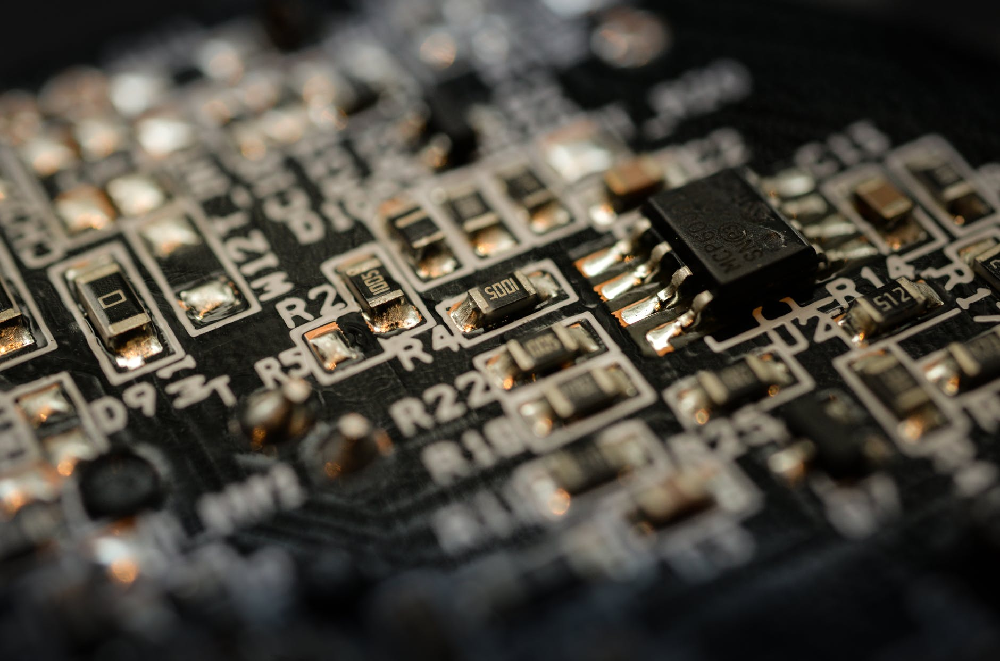

# meio_condutores

<h2>Descrição</h2>
Projeto de física que consiste na criação de um site sobre o tema semicondutores

<h2>To-do</h2>
<ul>
   <li>Servidor</li>
   <li>Site</li>
   <li>Textos</li>
   <li>Material dinâmico</li>
</ul>

